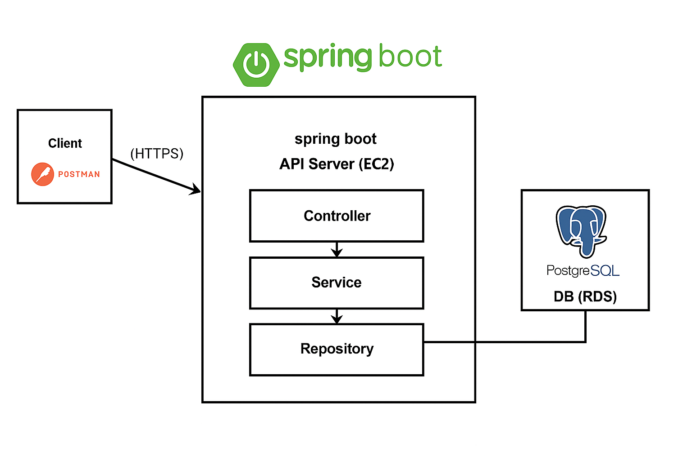
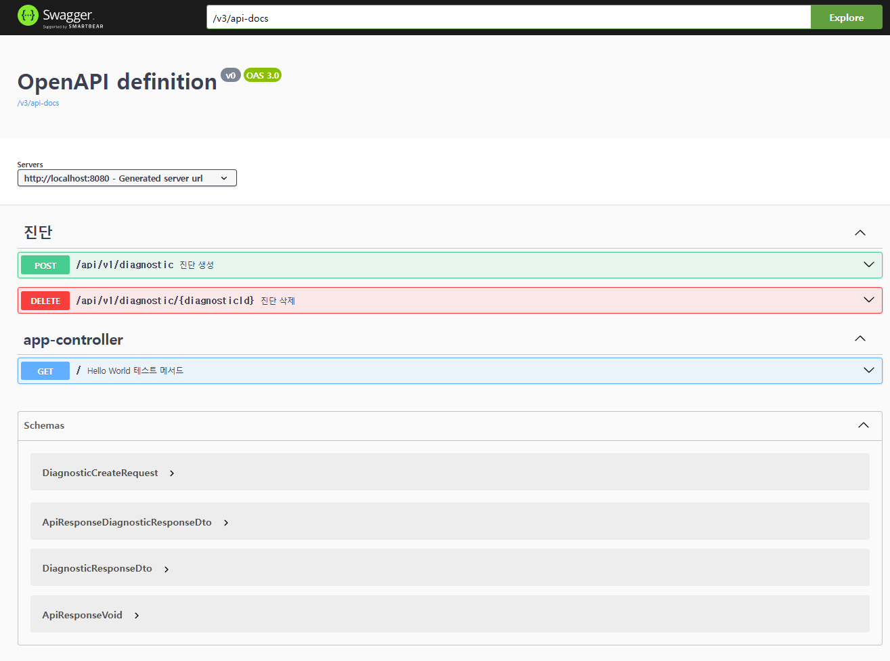
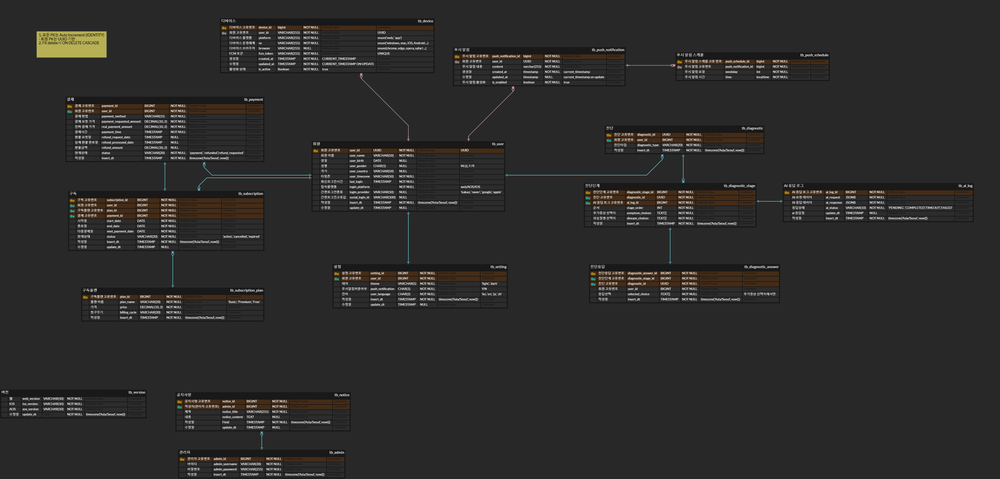

# redsignal-backend (미완성)

AI 진단 서비스 API 백엔드입니다.  
Spring Boot 기반으로 RESTful API를 제공하며, 사용자의 입력값에 따라 단계별 진단 결과를 반환하는 기능을 포함하고 있습니다.

---

## 프로젝트 정보

- 프로젝트명: redsignal
- 기간: 2025.02.20 ~ 2025.03.27
- 형태: 팀 사이드 프로젝트 (백엔드 중심)
- 주요 역할: DB 설계, AWS 배포 환경 구성, API 설계 및 구현

 

⚠️ 개인 사정으로 프로젝트에서 중도 이탈하였으며, 현재는 미완성 상태입니다.  
**📌 해당 저장소는 개인 작업물 보관 및 백엔드 설계 기록 용도로 유지됩니다.**

---

## 인프라 환경

- AWS EC2 (Ubuntu 24.04 LTS) 인스턴스 생성 및 배포
- AWS RDS (PostgreSQL 15.11) 인스턴스 구성 및 연동
- 무료 SSL 인증서(Let's Encrypt) 설치 및 HTTPS 적용
- 보안 그룹 설정 및 탄력 IP 적용

---

## 기술 스택

- Java 17
- Spring Boot 3.4.3
- Spring Security (JWT 인증)
- JPA (Hibernate)
- PostgreSQL
- Redis
- Swagger UI  
- 코드 스타일: 네이버 Java 코딩 컨벤션 기반. Checkstyle 설정은 적용했지만 일부는 포맷팅 툴(ctrl+alt+L/O)로 정리하거나, 맞지 않는 부분은 유연하게 넘어갔습니다 😅

---

## 디렉토리 구조

<pre>src/main/
├── java/
│   └── com/example/redsignal/
│       ├── common/           # 공통 모듈 (설정, 예외 처리 등)
│       ├── controller/       # API 컨트롤러
│       ├── service/          # 비즈니스 로직
│       ├── model/            # 도메인 모델
│       │   ├── dto/          # 요청/응답 객체
│       │   ├── entity/       # JPA 엔티티
│       │   └── enums/        # 열거형 정의
│       ├── repository/       # 데이터 접근 레이어
└── resources/
    ├── static/              # 정적 리소스
    └── application.yml      # 설정 파일
</pre>

---

## 아키텍처 구조

해당 아키텍처는 전체 서비스 구조가 아닌, 백엔드 서버(Spring Boot) 중심의 흐름을 정리한 도식입니다.  
직접 구현한 기술 요소를 중심으로 구성되었으며, 프론트엔드(클라이언트), 배포 자동화, 모니터링 등은 포함되어 있지 않습니다.

- AWS EC2 인스턴스(Ubuntu 24.04 LTS)에 Spring Boot 기반의 백엔드 서버를 수동 배포하였습니다.
- API는 Controller → Service → Repository 계층 구조로 구성되어 있으며, JPA를 통해 DB와 연동됩니다.
- 데이터베이스는 AWS RDS(PostgreSQL 15.11)로 구성되었으며, 퍼블릭 접근은 차단하고 EC2 인스턴스 내부에서만 접근 가능하도록 설정하였습니다.
- 로컬 개발 환경에서는 SSH 터널링을 통해 EC2를 경유하여 RDS에 접속하였습니다.
- 서버에는 무료 SSL 인증서(Let's Encrypt)를 설치하여 HTTPS 통신을 적용하였습니다.
- API 테스트는 Postman을 사용하였고, Swagger UI를 통해 전체 API 명세를 자동화하여 문서화하였습니다.

---

## API 문서 (Swagger)

진단 API의 Swagger 문서입니다.

- 생성: `POST /api/v1/diagnostic`
- 삭제: `DELETE /api/v1/diagnostic/{diagnosticId}`
- 테스트: `GET /` (Hello World)

---

## ERD

